# 🌾 AgriConnect – ML-Driven Agriculture Marketplace System

AgriConnect is a full-stack agriculture marketplace web application that connects Farmers, Customers, and Admins on a single platform. Farmers can list crops, customers can purchase crops, and admins can manage the complete system.

---

## 🚀 Features

### 👨‍🌾 Farmer
- Farmer Registration & Login
- Add, Edit & Delete Crop Listings
- Upload Crop Images
- View Daily Market Prices
- Weather Prediction (ML-based)
- Earnings Dashboard
- Order Management
- OTP-based Forgot Password

### 🛒 Customer
- Customer Registration & Login
- Browse Available Crops
- Buy Crops
- Compare Farmer Price with Market Price
- View Orders
- Download Invoice
- Notifications
- OTP-based Forgot Password

### 👨‍💼 Admin
- Dashboard
- Manage Farmers
- Manage Customers
- View Orders
- View Support Tickets
- Deleted Farmers & Customers

---

## 🛠️ Tech Stack

### Frontend
- HTML
- CSS
- Bootstrap 5
- JavaScript

### Backend
- PHP

### Database
- MySQL

### Machine Learning
- Python
- Weather Prediction Model

---

## 📂 Project Structure

```
AgriConnect
│── admin
│── assets
│── config
│── customer
│── farmer
│── ml
│── uploads
│── screenshots
│── index.php
```

---

## 📸 Project Screenshots

### Home Page
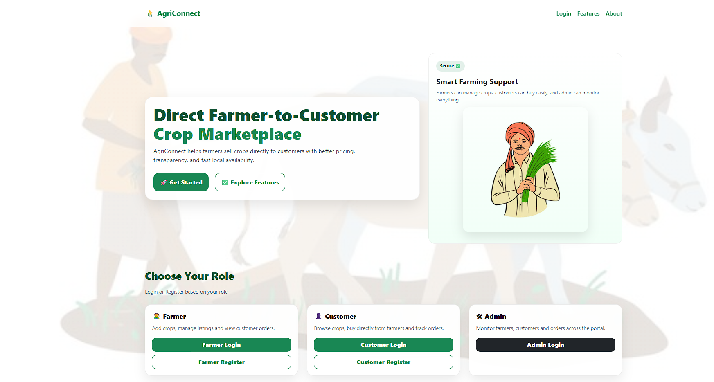

### Farmer Login
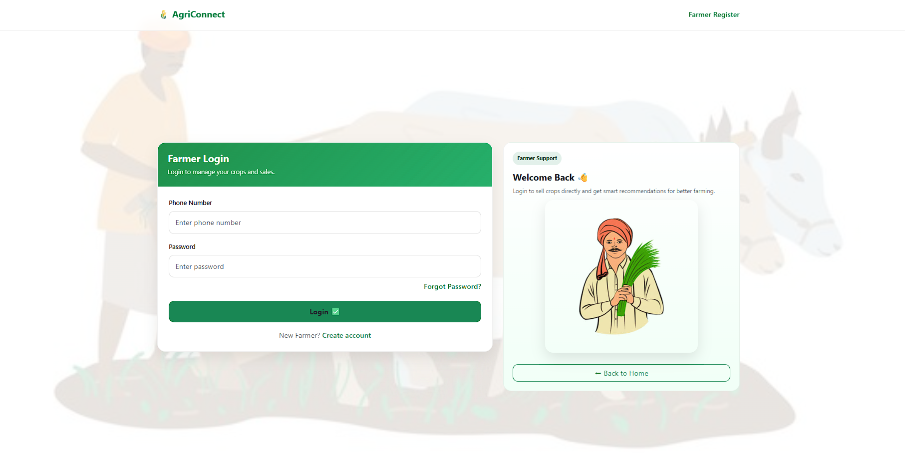

### Farmer Dashboard
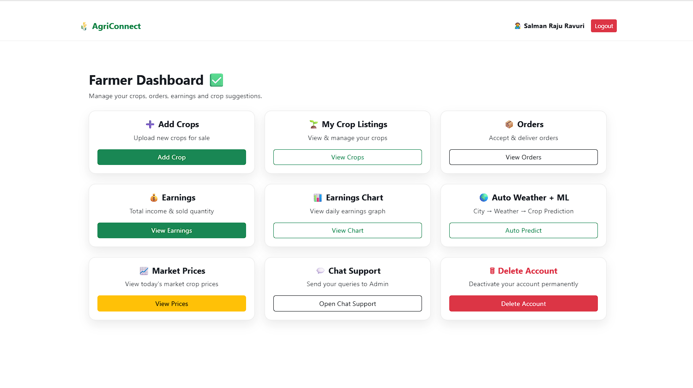

### Add Crop
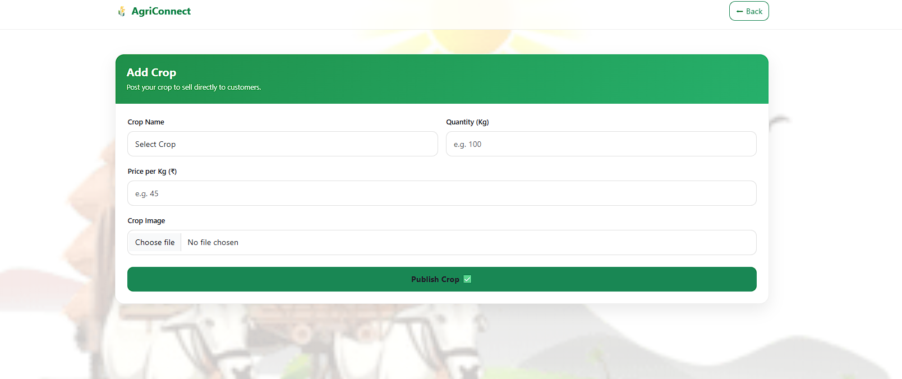

### My Crops
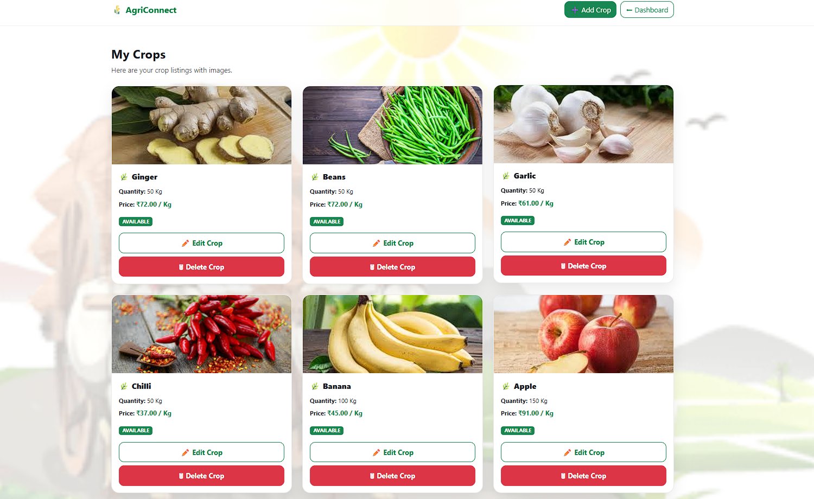

### Market Prices
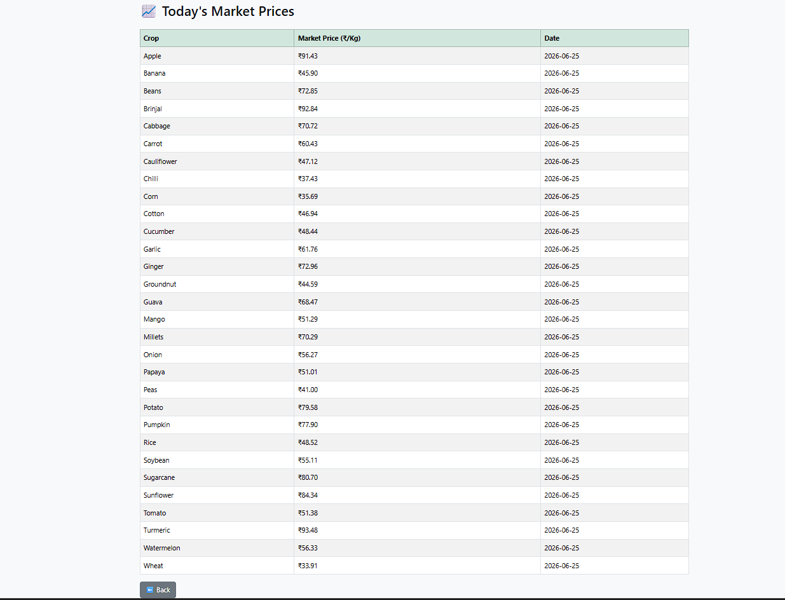

### Weather Prediction
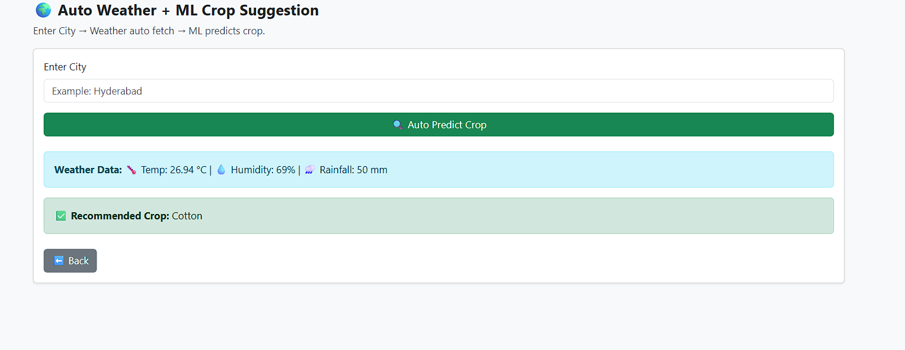

### Customer Dashboard
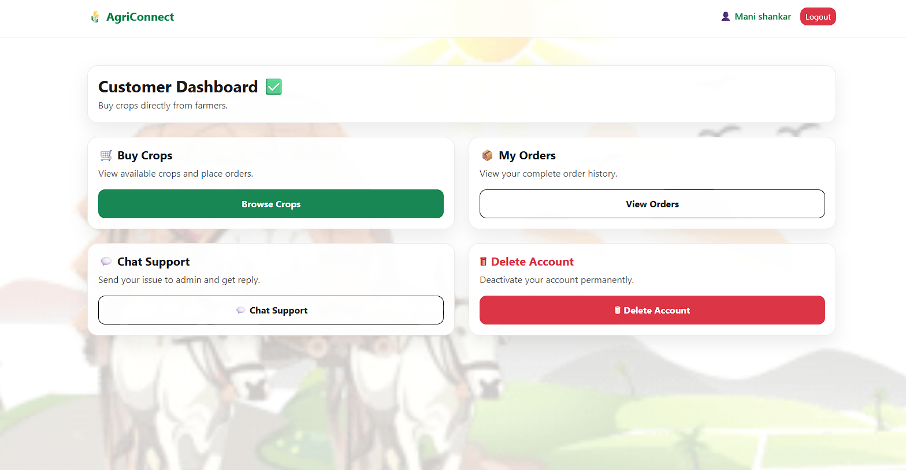

### Buy Crops
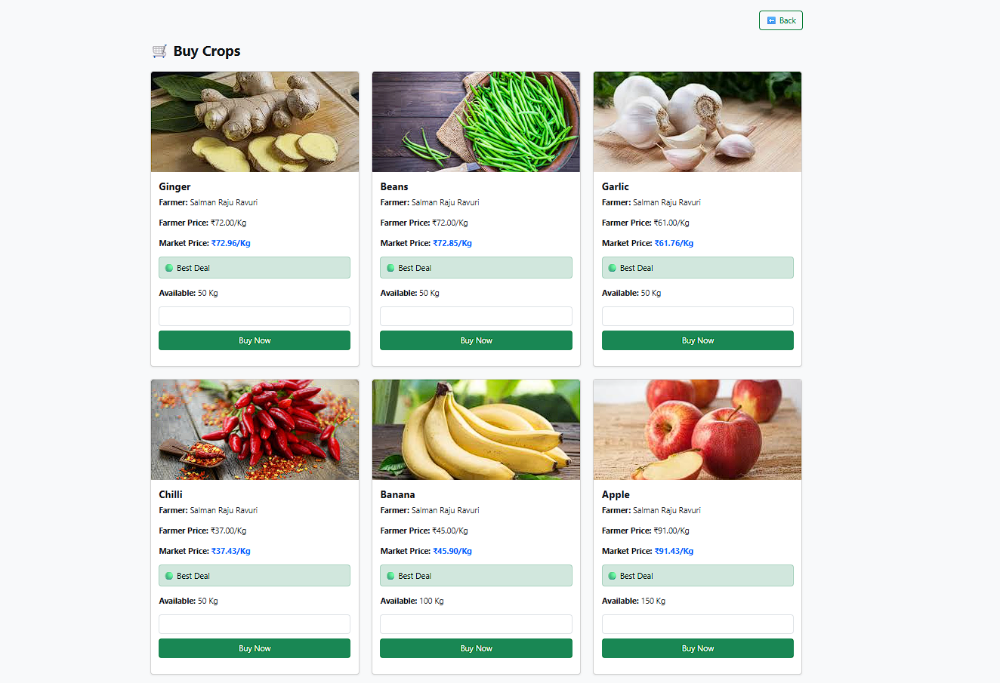

### Admin Dashboard
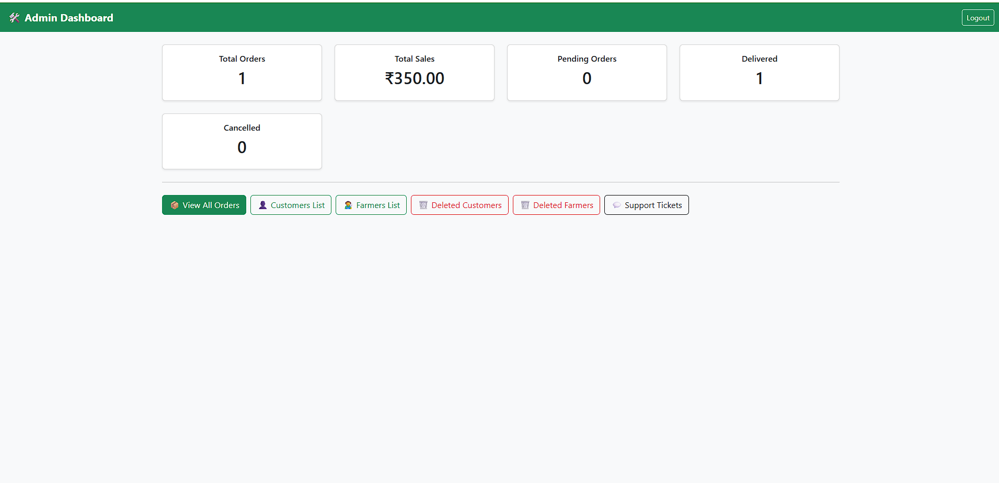

### Orders
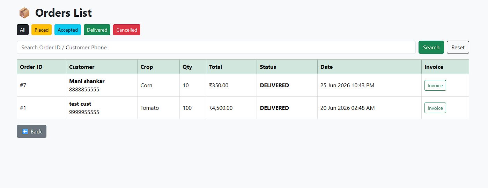

### Earnings Dashboard
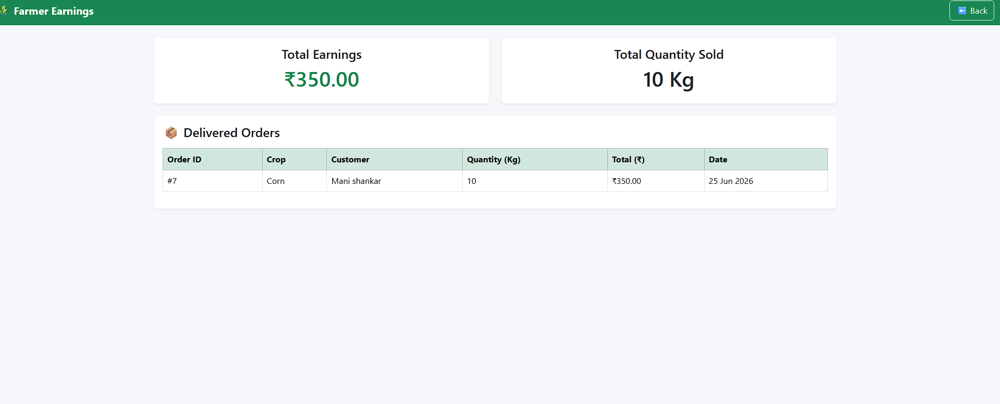

---

## ⚙️ Installation

1. Clone the repository

```bash
git clone https://github.com/RavuriSalmanRaju/AgriConnect-ML-Driven-Agriculture-Marketplace-System.git
```

2. Copy the project into:

```
C:\xampp\htdocs\
```

3. Start Apache and MySQL using XAMPP.

4. Import the MySQL database.

5. Open:

```
http://localhost/AgriConnect
```

---

## 👨‍💻 Author

**Salman Raju Ravuri**

- GitHub: https://github.com/RavuriSalmanRaju
- LinkedIn: https://www.linkedin.com/in/salmanraju-ravuri-899835291

---

⭐ If you found this project useful, consider giving it a Star.
